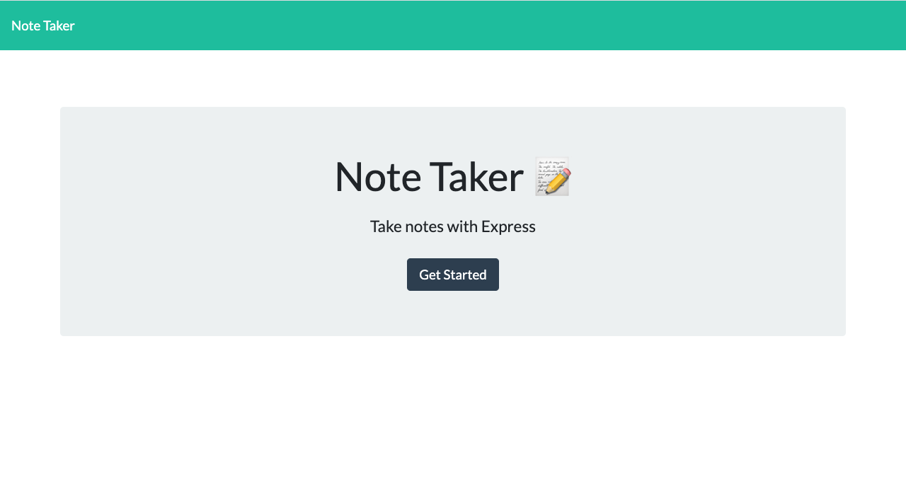
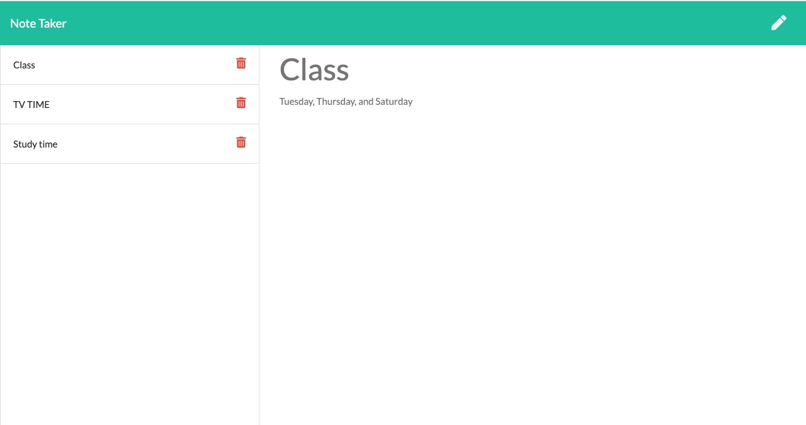

# Note_Taker

## License
   

  
   # Table of Contents

   * [Installation Instructions](#installation-instructions)
  
   * [Usage Instructions](#usage-instructions)
  
   * [Contribution](#Contribution)
  
   * [Developers Contact Information](#Developers-Contact-Information)

   * [License](#license)

   # Description

   * This application is developed to help people, project managers,even to every body  that can be used to write clearly and briefly, save, and delete notes.
   * This application uses an express backend and save and retrieve note data from a JSON file. .

   * Developers or users can quickly and easily create note or take notes as well as save,retrieve note and delete saved notes or new notes for their job. by using a command-line application to generate one. 

   * The app runs as a server.js to gather information about each notes. 

   * you can quickly create or taken notes.

   * My note taker application includes all necessary code that is readable, reliable, and maintainable Oftentimes, node_modules,  main Readme, screenshot images.

   * I put my LinkedIn profile, github and email address working activly.

   ## Installation Instructions

   * The developer is authorizing a free installation by cloning from the repository code:- 

   * [destish21/note_taker](https://github.com/destish21/note_taker)

   * you can run by install npm i to include node_module.

   * you can run by node server.js to note taker.

   * 
  
   * 

   ## Usage Instructions

   * For this app to run make sure first 
   intall the node_moduale.

   * make sure creat repository in your github.

   * Clone the code from my github 

   * [destish21/note_taker](https://github.com/destish21/note_taker)
 
   * note_taker and clone it in your comand line.

   * Make sure node_modules run by `npm i or npm installed`
     in your computer.

   * Once in the directory run npm install to install the node_modules needed to run the app.
    Run by `npx nodemon server.js`

   * You will be write notes on the application.

   * A `note_taker Completed wrote the  file !!`  will be desplayed after you wrote your note. 

   * you will see a high-quality, professional `note_taker` is generated with the title of my project.

   * you can generate a notes that displays basic info on note takers.

   * you can try  the note takers by commandline. 
       `npx nodemon server.js`

   * I built with diferent routes  get `/note` for `notes.html`file, and get `*` for `index.html`file.
   * GET `/api/notes` reads the `db.json` file and return all saved notes as JSON.

   * POST `/api/notes`  receives a new note to save on the request body, add it to the `db.json` file, and then return the new note to the client.

   * DELETE `/api/notes/:id` - Should receive a query parameter containing the id of a note to delete. This means you'll need to find a way to give each note a unique `id` when it's saved. In order to delete a note, you'll need to read all notes from the `db.json` file, remove the note with the given `id` property, and then rewrite the notes to the `db.json` file.

   * you can to be able to write and save notes.

   * you can to be able to delete notes  you've written before.

   * you can  quickly access to emails and GitHub profiles.

   * My `employee-team-profile-generator` is in my repository enjoy it!

   ## Contribution
  
   * This is Contributed by [destish21/note_taker](https://github.com/destish21/note_taker). 
   * But Contribution, issues and feature requests are welcome.
   * Feel free to check issues page if you want to contribute. 
   * you can contact me by Contact Information here below.

   ## Developers Contact Information
   * LinkdIn Profile: [Desta Mulualem](https://www.linkedin.com/in/desta-mulualem-6718b1203/)
   * Deployed URL :  [Note Taker](#)
   * github URL: https://github.com/destish21/note_taker

   * Email: destish21@yahoo.com
   
